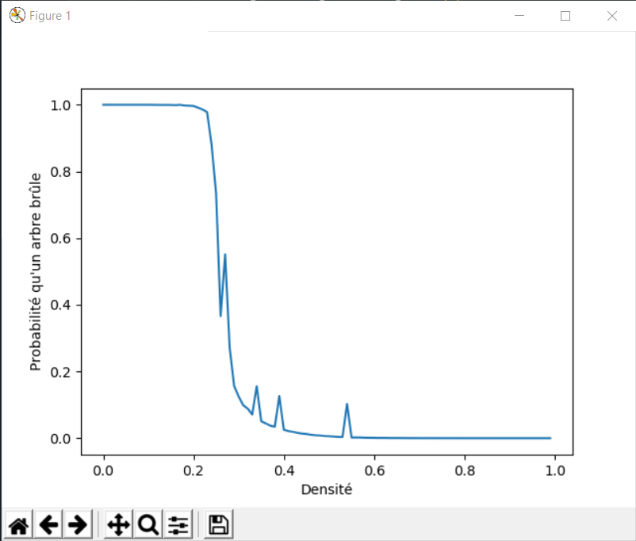
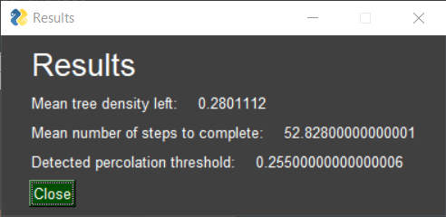

# Simulateur de feux de forêt

## Prérequis

- Python >=3.5
- Numpy
- PyGame
- MatPlotlib
- PySimpleGui (installable via `pip install pysimplegui`)

## Conditions d'expérience

Les simulations sont réalisées sur une grille carrée avec un pavage octodirectionnel.
La grille est, au départ, entièrement boisée.
Le feu démarre toujours sur la case la plus au centre.

## Structure de l'application

Le simulateur propose deux modes différents:

- Le mode *PyGame* exploitant PyGame pour proposer une animation graphique de la progression de la simulation mais ne lancant qu'une unique simulation.
- Le mode *fast* permettant d'itérer rapidement mais ne proposant qu'une simple barre de progression pour le suivi, sans animations graphiques. Il permet d'estimer le seuil critique de percolation en réalisant un Monte-Carlo sur des valeurs de percolation comprises entre 0 et 1, avec un pas et un nombre d'*epochs* défini par l'utilisateur.

Pour lancer l'application, il suffit d'exécuter la commande suivante:

```bash
python3 gui.py
```

On se retrouve alors devant une fenêtre offrant plusieurs paramètres à choisir:

- La taille de la grille utilisée dans la simulation (par défaut 25)
- La probabilité qu'un arbre prenne feu (uniquement pour le mode *PyGame*, par défaut 0.5)
- Le nombre d'*epochs* (uniquement pour le mode *fast*, par défaut 1)
- Le pas utilisé pour incrémenter le coefficient de percolation (uniquement pour le mode *fast*, par défaut 0.1)


Une fois la simulation terminée, une courbe représentant la densité d'arbres restants en fonction du coefficient de percolation s'affiche.
Une fenêtre présentant diverses statistiques s'affiche également:

- La densité moyenne d'arbres restants sur l'ensemble des simulation
- Le nombre moyen d'itérations nécessaires pour terminer une simulation
- Le seuil critique de percolation estimé (uniquement pour le mode *fast*)

Ces fonctions sont présentées plus en détails dans la section suivante.

## Résultats

Pour un grille de 100x100 avec un nombre d'*epochs* égal à 10 et un *delta* de 0.01.





On obtient dans ce cas un seuil de percolation estimé à 0.28.
Bien évidemment, ce résulat aurait été bien plus élevé dans le cas d'un pavage à seulement 4 directions.
